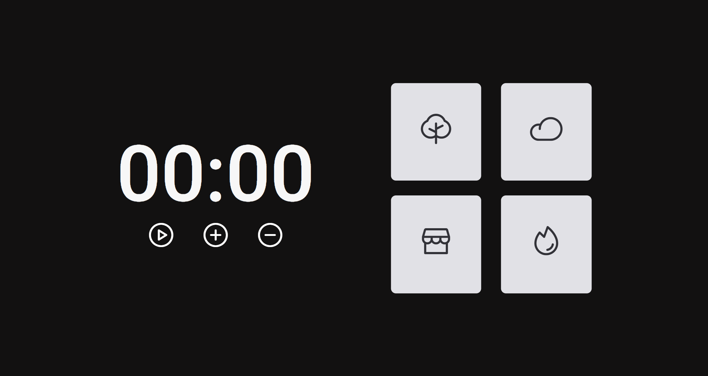

# FocusTimer

Projeto construído para fins de aprendizado  

  <a href="#-tecnologias">Tecnologias</a>&nbsp;&nbsp;&nbsp;|&nbsp;&nbsp;&nbsp;
    <a href="#-projeto">Projeto</a>&nbsp;&nbsp;&nbsp;

 

 

 

## 👾 Tecnologias

Esse projeto foi desenvolvido com as seguintes tecnologias:

- HTML, CSS e JS
- Git e Github
- Figma

## 🖼 Projeto

O site FocusTimer é um site onde o usuario utiliza como timer, sendo o botão + par adicionar 5 minutos e o botão - para subtrair, também podemos ver 4 tipo de botões onde toca um som referente ao icone exibido no botão como Floresta, Chuva, barulho de pessoas conversando em uma cafeteira e barulho de Lareira.

- [Visite o projeto online](https://enzorafaelpassos.github.io/FocusTimer/)